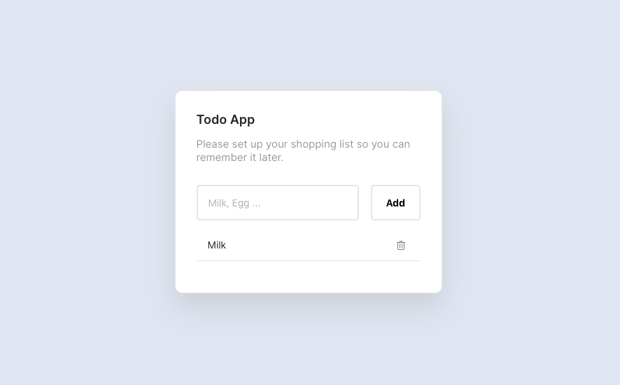

## Todo App

Simple Todo App with **Vue**. https://todo.pquinteros.now.sh/

 

  

### `npm serve`

Runs the app in the development mode. 
Open [http://localhost:8080](http://localhost:8080) to view it in the browser.

